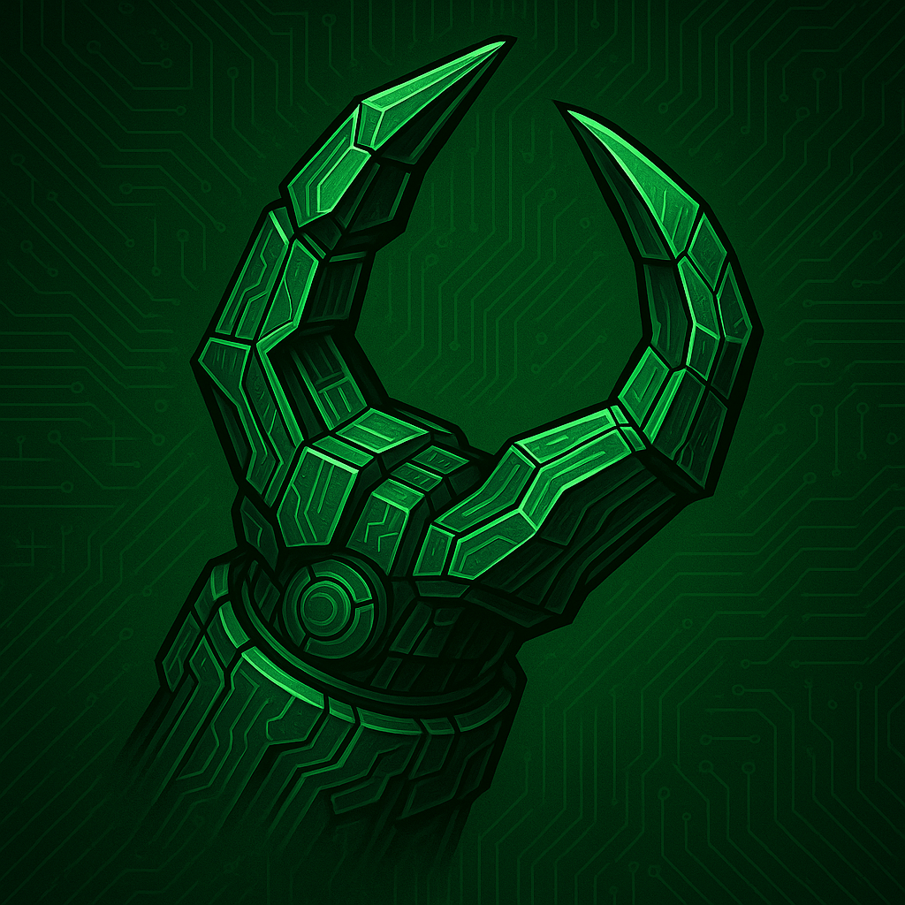

  

# ArmZilla

**ArmZilla** is a modular robotic arm project designed for The Lab — capable of:
- Sorting small screws and nuts.
- Removing and replacing 3D printer build plates.
- Following in "Follow Me" mode using a mobile touchscreen.
- Potential 3D printing functionality.
- (And yes… *theoretical* intruder deterrence via “death ray” 😉)

## Goals
- Reuse parts from Ender 3 and CR-10S printers.
- Max payload: ~1kg (suitable for flexible build plates + small prints).
- Modular joints for easy upgrades.
- Integration with The Lab’s LANzilla ecosystem.

## Roadmap
1. **Research & Design**
2. **Mechanical Build**
3. **Electronics & Control**
4. **Software Integration**
5. **Testing & Expansion**

## License
TBD
